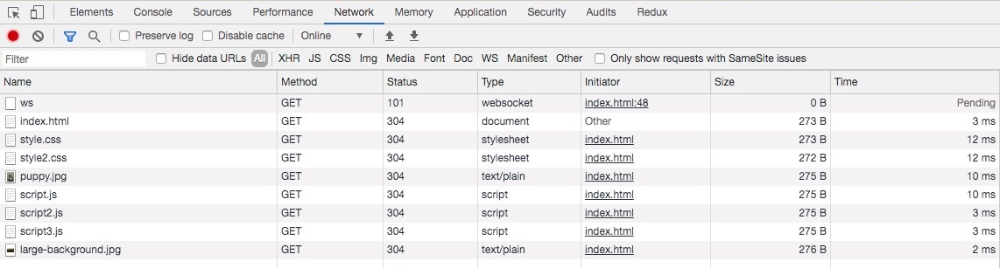

# The Complete Junior to Senior Web Developer Roadmap (2020)

## Table of Contents

- [The Complete Junior to Senior Web Developer Roadmap (2020)](#the-complete-junior-to-senior-web-developer-roadmap-2020)
  - [Table of Contents](#table-of-contents)
  - [**Section 2: SSH**](#section-2-ssh)
  - [**Section 3: Performance Part 1**](#section-3-performance-part-1)

## **Section 2: SSH**

- Introduction to SSH
  - HTTP: Hypertext Transfer Protocol
  - FTP: File Transfer Protocol
  - HTTPS: Hypertext Transfer Protocol Secure
  - SSH: Secure Shell Protocol
  - Host: Remote Server (OS: ubuntu)
  - Client: My computer
- SSH Command
  - SSH Command: `ssh {user}@{host}`
  - Connect to host: `ssh root@xx.xx.xx.xx`
  - Install Git: `sudo apt-get install git`
  - Install Node JS: `sudo apt-get install nodejs`
  - Install all dependencies: `apt install npm`
  - Delete all files in folder: `rm -rf dir1`
  - Delete all file: `rm file`
  - Quit host: `exit`
- Saving The Day Through SSH
  - rsync is a utility to transfer files between client and host
  - Example: `rsync -av . root@xx.xx.50xx.xx:~/superawesome.com`
- How SSH Works
  - Symmetric Encryption: use one secret key for both encryption and decryption by both parties
    - Both parties generate the secret key with public shared data using Key Exchange Algorithm
    - Secret key is specified to each SSH session
  - Asymmetric Encryption: use 2 separate secret key for encryption and decryption
    - Both parties generate temporary secret key
    - Difiie Hellman Key Exchange Algorithm
    - Encrpyt data with public key
    - Decrypt data with paired private key
  - Hashing
    - Verify the authentication of the message
    - Hash based Message Authentication codes
  - Passwords Or SSH?
    - Difiie Hellman Key Exchange
    - Arrive at Symmetric Key
    - Make sure of no funny business
    - Authenticate User
- SSH Into A Server:
  - Overview:
    - Generate public/private key pair at client
    - Share public key with host
    - SSH to host with public key at client
    - [How To Set Up SSH Keys](https://www.digitalocean.com/community/tutorials/how-to-set-up-ssh-keys--2)
  - How to setup manually?
    - Client: `cd ~/.ssh`
    - Generate public/private key pair: `ssh-keygen -t rsa -b 4096 -C "test@gmail.com"`
      - Public key: id_rsa_digitalocean.pub
      - Private key: id_rsa_digitalocean
    - Copy public key to clipboard: `pbcopy < ~/.ssh/id_rsa_digitalocean.pub`
    - Host: `ssh root@xx.xx.xx.xx`
    - Show hidden files: `ls -a`
    - Goto SSH folder: `cd .ssh`
    - Open authorized_keys file: `nano authorized_keys`
    - Paste public key: `Command-v`
    - Exit authorized_keys file and save: `Ctrl-x -> Press Y -> Press Enter`
    - Quit host: `exit`
    - Client: `ssh-add ~/.ssh/id_rsa_digitalocean`
      - Add id_rsa_digitalocean private key into the SSH authentication agent for implementing single sign-on with SSH
    - Host: `ssh root@xx.xx.xx.xx`
    - Open authorized_keys file: `nano authorized_keys`
    - Delete key: Place cursor at start of key -> `ctrl-k`
  - How to setup with digital ocean interface?
    - (Top Right Corner) My profile -> (Left SideBar) Settings -> Security Tab -> SSH keys
    - Note: Add the SSH key on the control panel -> create a new server
- [Set Up SSH on Github](https://help.github.com/en/github/authenticating-to-github/connecting-to-github-with-ssh)
  - Client
    - Generate public/private key pair: `ssh-keygen -t rsa -b 4096 -C "xxx@gmail.com"`
    - Add private key to ssh-agent: `ssh-add -K ~/.ssh/id_rsa_github`
    - Copy public key to clipboard:`pbcopy < ~/.ssh/id_rsa_github.pub`
  - Github: Add new public key
    - (Top Right Corner) Settings
    - (Left Sidebar) SSH and GPG keys
    - New SSH Key
    - Ctrl-v
  - Client
    - Test SSH connection: `ssh -T git@github.com`
    - Clone repo with ssh keys: `git clone git@github.com:chesterheng/learn-formik.git`
  - Github: Check SSH key display Last used within the last week — Read/write

**[⬆ back to top](#table-of-contents)**

## **Section 3: Performance Part 1**

- Introduction to Performance Part 1
  - Client make a request to Server
  - Server return HTML
  - Client render HTML and need CSS
  - Client request CSS from Server
  - Client request Assets from Server
  - Client request JS from Server
- Visitor expect site to load within 2 sec
- In order to display website,
  - Frontend: Send GET request to Backend
  - Backend: Receive the request
  - Backend: Retrieve data from database
  - Backend: Process data and return data to Frontend
  - Frontend: Render HTML and data from Backend
- 3 Keys To Performance
  - Improve the Frontend render
  - Transfer of file, network latency
  - Improve the Backend processing
- How to improve?
  - Frontend
    - Critical Render path (Part 1)
    - Optimized Code (Part 2)
    - Progressive Web App (Part 2)
  - Transfer
    - Minimize Files (Part 1)
    - Minimize Delivery (Part 1)
  - Backend
    - CDNs (Part 3)
    - Caching (Part 3)
    - Load Balancing (Part 3)
    - DB Scaling (Part 3)
    - GZIP (Part 3)
- Network Performance
  1. Honey I shrunk the files
  2. The traveling deliveryman
- Honey I shrunk the files
- Minimize Text: HTML, CSS, JS (Revisit in Webpack)
  - [UglifyJS](https://skalman.github.io/UglifyJS-online/)
- Minimize Images
  - JPG: e.g. photograph
    - lot of colors required
    - no transparent background
  - GIF: use for small animation
  - PNG: e.g. logo
    - less colors required
    - transparent background
  - SVG: vector graphic, expand without distortion
- Resources: Image File Formats
  - [Image file formats: when to use each file type](https://99designs.com/blog/tips/image-file-types)
  - [Page Weight Tool](https://pageweight.imgix.com)
  - [GIF, PNG, JPG or SVG. Which One To Use?](https://www.sitepoint.com/gif-png-jpg-which-one-to-use)
- Image Optimizations
  - If you want transparency: use a PNG
  - If you want animations: use a GIF
  - If you want colourful images: use a JPG
  - If you want simple icons, logos, and illustions: use SVGs
  - Reduce PNG with [TinyPNG](https://tinypng.com)
  - Reduce JPG with [JPEG-optimizer](http://jpeg-optimizer.com)
  - Reduce SVG with [Nano](https://vecta.io/nano)
  - Try to choose simple illustrations over highly detailed photographs
  - Always lower JPEG image quality (30 - 60%)
  - Resize image based on size it will be displayed
  - Display different sized images for different backgrounds
    - [Media Queries](https://css-tricks.com/snippets/css/media-queries-for-standard-devices/)
    - [Media Queries Cheat Sheet](https://gist.github.com/bartholomej/8415655)
  - Use CDNs like imigx
  - [Remove image metadata](https://www.verexif.com/en/)
- Exercise: #1 - Media Queries
- The traveling deliveryman
  - Less trips: is CSS framework necessary?
  - Less trips: is JS library necessary?
  - Browser: 2-6 [max currently request](https://stackoverflow.com/questions/985431/max-parallel-http-connections-in-a-browser)
  - Combine all CSS files into one
  - Combine all JS files into one
- Exercise: #2 - Network Optimizations
  - Minimize all text: e.g. [CSS and JS Minifier](https://www.minifier.org/)
  - Minimize images
  - Media Queries
  - Minimize # of files

- Critical Render Path Introduction
  - DOM -> CSSOM -> Render Tree -> Layout -> Paint
  - Client: 1. Request HTML file from server
  - Server: Return HTML file
  - Client: Parse HTML and start to build the DOM
  - Client: Request external resources from server
  - Client: 2. Request CSS file from server
  - Server: Return CSS file
  - Client: Parse CSS and start to build the CSSOM
  - Client: 3 .Request JS file from server
  - Server: Return JS file
  - Client: 4. DOMCOntentLoaded state
  - Client: Read JS file and make changes to the DOM or CSSOM
  - Client: Combine DOM and CSSOM into a render tree
  - Client: Figure out the layout and positioning with the render tree
  - Client: Paint all the pixels on the browser
  - CLient: Request photo when encounter image tag from server
  - Client: Start to download photo in the background 
  - Client: Show when downloaded
  - Client: JS modified Render tree due to user trigger events
- Critical Render Path 1
  - HTML: Load style tag in the `<head>`
  - HTML: Load script right before `</body>`
- Critical Render Path 2
  - CSS: Only load whatever is needed
  - CSS: Above the fold loading: load necessary style first
  - CSS: Media Attributes
  - CSS: Less Specificity
- Critical Render Path 3
  - JS: Load Scripts asynchronously
  - JS: Defer Loading of scripts
  - JS: Minimize DOM manipulation
  - JS: Avoid long running JavaScript
  - Resource: [Loading Third-Party JavaScript](https://developers.google.com/web/fundamentals/performance/optimizing-content-efficiency/loading-third-party-javascript)
  - Resource: [Async + Defer](https://stackoverflow.com/questions/10808109/script-tag-async-defer)
- Critical Render Path 4
  - Download HTML -> Construct DOM
  - Download CSS -> Construct CSSOM
  - Download JS -> Modify DOM and CSSOM
  - Construct render tree with DOM and CSSOM
  - Figure layout and positioning from the render tree
  - Paint pixels on the screen
  - Load image in the background and display web page
- Exercise: #3 - Critical Render Path
- Free course: [The Critical Rendering Path](https://www.udacity.com/course/website-performance-optimization--ud884)
- Exercise: #4 - Keiko Corp Website
  - [PageSpeed Insights](https://developers.google.com/speed/pagespeed/insights/)
  - [WebPageTest](https://www.webpagetest.org/)
- Resource Prefetching: [Prefetching, preloading, prebrowsing](https://css-tricks.com/prefetching-preloading-prebrowsing/)
- [Performance Tools](https://www.udemy.com/course/the-complete-junior-to-senior-web-developer-roadmap/learn/lecture/10210456#content)
- [HTTP/2](https://developers.google.com/web/fundamentals/performance/http2/)
- [HTTP/3](https://blog.cloudflare.com/http3-the-past-present-and-future/)

**[⬆ back to top](#table-of-contents)**
